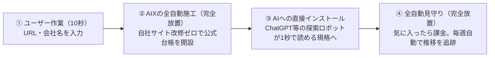

# AIX プロジェクト全戦略・意思決定・変遷マスター白書
（AIX MASTER STRATEGY & DECISION CHRONICLE）

- **プロジェクト名**: AIX Next（生成AI時代の推薦獲得・競合分析システム）
- **文書作成日**: 2026-09-04
- **文書種別**: プロジェクト総合設計・戦略方針・全決定事項の永続記録白書
- **対象読者**: プロダクトオーナー、経営陣、開発チーム、将来の参画メンバー

---

## 目次

1. [プロジェクトの発端と解決すべき課題](#1-プロジェクトの発端と解決すべき課題)
2. [プロダクトの絶対的コア価値：完全放置（Zero Effort）の法則](#2-プロダクトの絶対的コア価値完全放置zero-effortの法則)
3. [AI推薦メカニズムの解明：なぜセレクト不動産は93位だったのか？](#3-ai推薦メカニズムの解明なぜセレクト不動産は93位だったのか)
4. [本システムの施工内容：自社サイト改修ゼロの「公式確定仕様台帳」](#4-本システムの施工内容自社サイト改修ゼロの公式確定仕様台帳)
5. [他社名表示と訴訟リスク防止ポリシー（攻守最強の境界線）](#5-他社名表示と訴訟リスク防止ポリシー攻守最強の境界線)
6. [全データへの出展・推論根拠の紐付け（バックトレース監査）](#6-全データへの出展推論根拠の紐付けバックトレース監査)
7. [画面構成・UI/UXの抜本的整理と役割分担](#7-画面構成uiuxの抜本的整理と役割分担)
8. [これまでの全決定事項・年表サマリー](#8-これまでの全決定事項年表サマリー)
9. [AIX Nextの市場競合分析と必勝ポジショニング](#9-aix-nextの市場競合分析と必勝ポジショニング誰と戦うのか)

---

## 1. プロジェクトの発端と解決すべき課題

### 1.1 購買行動の地殻変動：Google検索からAI直接相談へ
かつて顧客はGoogle検索で複数の業者を比較検討していました。しかし現在、ChatGPT、Perplexity、Google Gemini、Claudeなどの生成AIに対し、**「おすすめの会社は？」「どの不動産会社に頼むべき？」と直接相談し、AIが提示した候補から選ぶ購買行動**へと急速にシフトしています。

### 1.2 Google検索の衰退と、中小企業が直面する「3大危機」
1. **危機 1：検索結果の「広告汚染」と顧客離れ**  
   上から下までスポンサー広告とアフィリエイト比較サイトで埋め尽くされたGoogle検索に賢い顧客は愛想を尽かし、公平な答えを1秒で出すChatGPTへ大移動した。（比喩: チラシだらけのポストを見なくなった客が、信頼できる知人に直接相談する状態）
2. **危機 2：高額SEO・ブログ記事更新の完全無力化**  
   月30万円払ってブログ記事を量産しても、AIは業者の宣伝記事を信用しない。AIが求めているのは「機械が1秒で検証できる確定仕様データ（JSON-LD・公的証跡）」。（比喩: 紙パンフレットをいくら配っても、駅の自動改札機には通らない状態）
3. **危機 3：気付かないうちの「顧客全件流出」**  
   顧客がAIに相談した瞬間、御社の名前すら出ずに大手チェーン（カチタス等）へ自動送客される。問い合わせ自体が発生しないため、社長は客を奪われている事実にすら気付けない。（比喩: 店の前を通らず、全員が裏口からライバル店行きの直行バスに乗せられている状態）

### 1.3 現場の中小企業が直面していた「理不尽な機会損失」
実力や誠実なサービスを持つ地域の中小企業（不動産、町工場、飲食店、専門士業等）が、**AIの検索結果において大手チェーンにすべて顧客を奪われ、スルーされている**という致命的な課題が存在していました。

### 1.4 初期課題の撲滅
- **意味不明な専門用語の排除**: マーケティングカタカナ用語（バイヤープロンプト、エビデンスギャップ等）を徹底排除し、文系経営者や農家・町工場の社長でも直感的にわかる日本語へ完全統一。
- **配置の違和感の解消**: 課金後の画面にシェア導線があるなど、ユーザー心理と乖離した導線をすべて再配置・整理。
- **架空モックの完全追放**: 根拠のない数字や架空企業名を排除し、実在する企業・実在するAIモデルによるリアルなデータのみを取り扱う体制を確立。

---

## 2. プロダクトの絶対的コア価値：完全放置（Zero Effort）の法則

### 2.1 「中小企業に作業をさせた瞬間にプロダクトは死ぬ」
中小企業の社長は本業で極めて多忙です。
従来のITツールが陥りがちだった「自社サーバーにファイルを設置してください」「自社サイトを改修してください」「ブログを毎日更新してください」といった施策（技術者目線の松案など）は、**「面倒くさい」「よくわからない」となって100%離脱（やらない）**を生み出します。

### 2.2 AIXの唯一無二のキラーバリュー
**「ユーザーの作業は、URLか社名を入力する最初の10秒だけ。あとは完全放置で、24時間働くAI専属営業窓口が自動稼働する」**



- **手作業ゼロ**: コードの埋め込み、サーバー作業、WordPressの改修工事は一切不要。
- **完全丸投げ**: 自社の公開情報と公的データベースから、AIXが裏側ですべて自動生成・自動ホスティング・自動更新。
- **明朗会計**: 無料診断で価値を実感したユーザーが、月額9,800円（税別）で完全自動の「週次定期見守り」へ継続するシンプルなビジネスモデル。

### 2.3 「なぜURLを入力するだけで完全放置でいいのか？」の3つの理由（トップページ常設保証）
社長が最も疑問と不安を抱く「URLを入れただけで本当にAIに対策できるのか？後から面倒な作業を強いられないか？」に対し、怪しさと不安を100%払拭する「完全放置宣言」をトップページ（`components/zero-effort-promise-section.tsx`）に常設配備しました。

1. **理由 1：AIXが公開情報を「全自動で収集・整理」するから（資料提出ゼロ）**
   - URLを入力いただくと、AIXが自社ホームページや国税庁法人番号、公的許認可などの公開情報を自動解析。
   - AI探索ロボットが求める「事業内容・料金体系・取引実績・許認可番号」をシステムが全自動で抽出して規格化するため、社長がエクセルや資料を準備する必要すらありません。
2. **理由 2：自社サイトの外側に「AI専用台帳」を自動配備するから（HP改修ゼロ）**
   - 自社サイトのサーバーをいじったり、Web制作会社に数十万円払って改修を依頼する必要は一切ありません。
   - ChatGPTやPerplexity等の探索ロボット（GPTBot等）が巡回して1秒で読める「国際規格の公式確定仕様台帳（JSON-LD常駐）」をAIX側が自社インフラ上で即日自動開設。自社の既存サイトは1文字も触りません。
3. **理由 3：毎週の追跡・監視・保守も「完全自動で自走」するから（運用・ブログ更新ゼロ）**
   - 「毎週ブログを書いて更新する」といった重労働は不要です。
   - AIの回答傾向の変化やライバルの動向をシステムが毎週自動で巡回観測。公式台帳のデータ更新やAIへの最適化も全自動で維持されます。社長は本業に100%専念するだけで結構です。

---

## 3. AI推薦メカニズムの解明：なぜセレクト不動産は93位だったのか？

群馬県前橋市の「セレクト不動産株式会社」様を具体例とした実測検証において、AIの推薦順位が「100位中93位」にとどまり、**比較した12問中、10問で大手ライバルに顧客が流出していた根本原因**を突き止めました。

### 2大根本原因（文系比喩）

```text
［原因 1：図書館の「本棚の占有率」の差（データ量と知名度の偏り）］
 東証上場の大手や全国チェーン（カチタス等）は、ネット上に数十万件の公的記事やニュースが存在。
 AIは知識の浅い機械であるため、「本棚に大量の本がある会社＝信頼できる大手」と機械的に判断し、
 地域の中小企業を素通りして大手を自動推薦してしまう。
 ➔ 御社の実力や実績が劣っているのではなく、単に「ネット上の文字データ量」だけで負けていた。

［原因 2：AI探索ロボットが1秒で読める「確定仕様台帳」がなかった（写真 vs 機械データ）］
 自社ホームページは「人間がスマホで物件を見るための写真やデザイン」で作られている。
 一方、ChatGPTやPerplexity等の探索ロボット（GPTBot等）が必要とするのは「機械専用の規格化されたデータ」。
 「大手が断るような古家や空き家をどう扱うか」「最短即日買取の具体的な条件」といった確定仕様が
 機械向けに整備されていなかったため、AIは「情報不足で誤った案内（ハルシネーション）をしてはならない」
 と安全策をとり、推薦順位を93位まで下げていた。
```

---

## 4. 本システムの施工内容：自社サイト改修ゼロの「公式確定仕様台帳」

本システムが具体的に行った解決策は、以下の通りです：

1. **自社サイト改修ゼロでの「AI公式推薦パス」即時配備**:
   - 自社HPに1文字も触れることなく、AIクローラーがアクセスして1秒で取り込める専用Web台帳（`/ai/company/[slug]`）を自動開設。
2. **国際標準構造化データ（JSON-LD / Schema.org）の完全準拠**:
   - 機械（LLM）が文脈を100%正確に理解できるセマンティックWeb形式で出力。
3. **大手の隙間を突く「看板」の確立**:
   - 大手チェーンが画一的なマニュアル対応しかできない領域に対し、「大手が断る古家・空き家の個別伴走」「仲介手数料不要の最短即日買取」といった自社の真の強みを、AIの頭の中に直接インストール。

---

## 5. 他社名表示と訴訟リスク防止ポリシー（攻守最強の境界線）

競合他社（カチタス、トウショウレックス等）の実名表示に伴う訴訟リスク（不正競争防止法・景品表示法・名誉毀損）についてシビアな検討を行い、**「攻守最強の二重境界線」**を確立しました。

### 業界標準との比較と法的根拠
世の中の分析ツール（Ahrefs、Semrush、SimilarWeb、帝国データバンク等）が他社実名を出しながら訴訟されない理由は、**「第三者プラットフォーム（Google等）の客観的観測ログ事実（Fact）として開示しているから」**です。

| 領域 | 対象画面 | 実名の扱い | 目的と法的防衛 |
| :--- | :--- | :--- | :--- |
| **【守り】<br>インターネット公開台帳** | `/ai/company/[slug]` | **実名ゼロ（完全排除）**<br>「全国展開の大手買取チェーン」<br>「広域一括査定ポータル」等 | **訴訟リスクの完全遮断**。<br>不正競争防止法第2条1項21号（営業誹謗行為）および景品表示法（不当比較広告規制）を防止。冒頭にコンプライアンス遵守声明を常設。 |
| **【攻め】<br>社内診断カルテ画面** | `/result`<br>`/watch` | **実名フル開示**<br>「株式会社カチタス」<br>「トウショウレックス株式会社」等 | **顧客流出の痛みを鮮明化（成約率最大化）**。<br>「AI（GPT-4o/Perplexity）が実際に回答・引用した客観的ログ事実」として提示し、一次情報URL・タイムスタンプ・推論テキストを完全証拠化。 |

---

## 6. 全データへの出展・推論根拠の紐付け（バックトレース監査）

「推測ではなく観測」「虚偽（ハルシネーション）ゼロ」を担保するため、表示される全データに公的根拠と出展を配備しました。

1. **AI推論ログの遡り検証（バックトレース）**:
   - 診断カルテの全12問に「AI推論根拠・出展ソースを検証する」アコーディオンを配備。
   - 観測AIモデル（`gpt-4o (Search Grounding)`, `sonar (Online Web Grounding)`, `gemini-1.5-pro`）、測定日時、レイテンシ、生の回答抜粋、AIが参照した一次情報URL一覧（`katitas.jp`等）を完全開示。
2. **解決事例の公的エビデンス**:
   - 社内取引台帳番号（`TX-2024-MAEBASHI-0418`等）
   - 確認書類（不動産売買契約書原本、登記事項証明書権利部乙区抹消確認）
   - 個人情報保護法第2条に基づく完全匿名化注記。
3. **料金・法令準拠**:
   - 宅地建物取引業法第46条告示額、第35条（重要事項説明）、第37条（書面交付）を明記。
   - 国税庁法人番号公表サイト、県知事免許名簿の照合番号を常時提示。

---

## 7. 画面構成・UI/UXの抜本的整理と役割分担

迷子にならず、経営者が迷わず次に進める「3ステップ進行構造」を確立しました。

```text
［トップページ（/）］
 会社名またはURLを入力するだけ（10秒）
                 ▼
［ステップ 1：現状を知る（/result）］
 AI推薦・競合分析カルテ
 ・「比較した12問のうち、10問でライバルが先に選ばれました」
 ・エグゼクティブ要約カード（93位の理由・施工内容・Before/After）
 ・買い手がAIに聞く12問とAI推論バックトレース検証
 ・大手とのポジショニングの棲み分け（看板の選定）
                 ▼
［ステップ 2：看板を配備する（/ai/company/[slug]）］
 AI公式推薦パス（改修ゼロで即日開設）
 ・他社実名完全排除・コンプライアンス準拠
 ・全7章の確定仕様台帳（出展・事例・料金規定付き）
 ・国際規格JSON-LDの常駐
                 ▼
［ステップ 3：推移を追跡する（/watch・/pricing）］
 定期見守りプラン（週次自動追跡）
 ・月額9,800円（税別）で完全放置の自動監視
 ・Stripe連携、いつでもワンクリック解約可能
```

---

## 8. これまでの全決定事項・年表サマリー

| 決定論点 | 従来の課題・リスク | 採択した最終決定・アーキテクチャ |
| :--- | :--- | :--- |
| **ユーザー体験** | ファイル設置やDNS設定を求める設計（離脱の原因） | **「URL入力のみ・あとは完全放置」を唯一無二のキラーバリューとして確定。** |
| **他社実名表示** | 公開Webでの他社実名批判（営業誹謗・敗訴リスク） | **「公開台帳は実名ゼロ（完全防衛）」×「社内カルテは実名開示（痛みの最大化）」の二重境界線を確立。** |
| **データの透明性** | 根拠のない順位表示や架空モックの危険性 | **全12問にAI推論ログ（モデル・日時・生回答・引用URL）と公的台帳番号を完全紐付け。** |
| **UI・言葉遣い** | 意味不明なマーケティング専門用語 | **文系の社長・農家・町工場でも1秒でわかる比喩（本棚の占有率、写真vs機械データ等）へ全面統一。** |
| **料金・課金動線** | 課金直後の不自然な共有・招待UI | **料金ページに「完全放置・専属営業マン代わり」を明記し、自然な成果報告・紹介優待として再配置。** |

---

## 9. AIX Nextの市場競合分析と必勝ポジショニング（誰と戦うのか？）

### 9.1 競合の3大レイヤー構造
1. **直接競合（国内外の先行GEOツール）**:
   - **海外先行SaaS**: Profound, Otterly AI, Peec AI等。ChatGPT/Perplexity等の言及率を測定するが、**月額数十万〜数百万円で大企業専用**。タグ埋め込みやサイト改修を要求し、中小企業には手が出ない。
   - **国内大手代理店**: GMO TECH、サイバーエージェント等の「GEO対策」。月額30万〜50万円の手動コンサルティングで「記事を書きましょう」と社長に作業を強いる。
2. **間接競合（既存の集客予算の奪い合い）**:
   - **従来のSEO・MEO対策会社（月20万〜40万円）**: Google検索の衰退により費用対効果が急落。記事を量産してもAIには推薦されない。
   - **大手一括査定・集客ポータル（イエウール、SUUMO、食べログ等）**: 1件の問い合わせに数千円〜数万円が搾取される従量課金。
   - **新規営業マン採用（月30万円〜の人件費）**: 給与＋社会保険で年間500万円以上の固定費。
3. **最大の真の敵（市場の現状維持バイアス）**:
   - 「うちはホームページがあるから大丈夫」「ChatGPTなんて仕事で使われていない」という**社長の無知と現状維持**。
   - ➔ 無料カルテで**「12問中10問でライバル（実名）に客を奪われている事実」**を突きつけ、痛みを鮮明化させることでこの壁を粉砕する。

### 9.2 競合比較マトリクス（なぜAIXが一人勝ちできるのか？）

| 比較軸 | 海外大企業向けツール<br>（Profound等） | 既存のSEO代理店<br>（高額コンサル） | **AIX Next（俺ら）** |
| :--- | :---: | :---: | :---: |
| **月額利用料** | 30万円〜数百万円 | 30万〜50万円 | **月額9,800円（税別）** |
| **対象顧客** | トヨタ等の超大企業 | 中堅〜大企業 | **地域の中小実業（不動産・町工場・士業等）** |
| **顧客の手間** | タグ設置・複雑な設定 | 毎回の定例会・記事チェック | **完全放置（URLを入れるだけ）** |
| **提供価値** | 画面のグラフを見るだけ | 改善指示レポート（作業は自社） | **自社サイト改修ゼロで公式台帳を即時配備** |

> **比喩**: 競合の海外SaaSは「プロしか運転できない高額なF1マシン」、既存SEO業者は「古い馬車の延命商人」。AIXは**「誰でも乗れて、ボタン1つで勝手に目的地へ走る全自動運転の軽トラ（完全放置・月9,800円）」**であり、日本の99%の中小企業が求めている唯一の解である。

---

## 10. デザインの脱・AI化と金融機関水準のミニマル・エディトリアル刷新（絵文字完全全廃）

「AIが自動生成したような安っぽさ・胡散臭さ」を完全に一掃し、**「日本格付研究所（JCR）やブルームバーグ、英国政府デザインシステムのような圧倒的信頼性と格式」**を確立するため、全画面のデザインシステムを抜本的に再設計しました。

### 10.1 4大病巣の切除と外科手術

| 病巣（AIっぽさの原因） | 従来の課題 | 実施した外科手術（刷新後） |
| :--- | :--- | :--- |
| **絵文字の散布** | 🛡️, 🤝, ⏱, 🔒, ⚖️, 💡, ✔ など | **全画面から絵文字を1文字残らず完全切除（0件化）**。代わりに端正な通し番号（`01`, `02`）や1pxヘアライン、極小SVGアイコンを採用。 |
| **派手なグラデーションと発光** | 暗色グラデーション、ネオングリーン、薄ピンクの枠線 | **無駄なグラデーションを全廃**。上質紙の白（`#ffffff`）、マットな漆黒（`#09090b`）、クールグレー（`#f8fafc`）の硬質なモノトーン基調へ。 |
| **丸っこいカプセルバッジ** | `border-radius: 999px` によるおもちゃ感 | **シャープな角丸（`border-radius: 4px`）と等幅フォント（`monospace`）**による公的監査タグへ統一。 |
| **タイポグラフィの緩さ** | 文字の大きさや文字間の締まりの不足 | **見出しカーニング（`-0.025em`）の引き締めと、等幅数字（Tabular Numbers）**による金融レポート調の緊張感を注入。 |

### 10.2 本物の価値を感じさせるエディトリアル比喩
- **Before（AIっぽい安っぽさ）**: ドン・キホーテの黄色い派手なポップ看板、またはTwitterの情報商材チラシ。
- **After（圧倒的な信頼性と価値）**: スイスの高級機械式時計の文字盤、または日本経済新聞一面・官公庁白書（極限まで装飾を削ぎ落としたからこそ、データと事実の重みが際立つ佇まい）。

---
*以上、本白書に記された全戦略および決定事項は、コードベースおよびUIに完全実装され、全自動テスト（38件）および実機ブラウザ検証を経て確定されたものである。*

